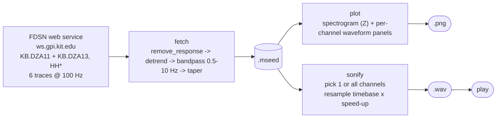
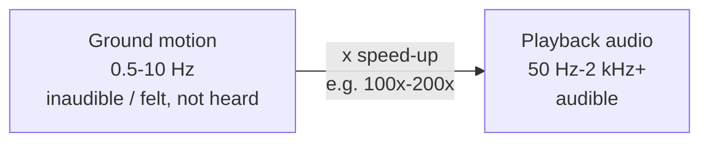

# DZA01 Seismic Sonification Toolkit

A single-file Python CLI that pulls real seismic waveform data from the
**DZA01 borehole station (`KB` network, KIT/GPI seismic network)**, plots
it as a spectrogram + waveform figure, and **sonifies** it: it speeds up
the recording so ground motion normally far below the range of human
hearing (0.5–10 Hz) becomes audible sound.

It is plain, auditable scientific tooling, not a black box: standard FDSN
retrieval via [ObsPy](https://docs.obspy.org/), standard instrument-response
removal and bandpass filtering, and a transparent "resample the timebase"
audification method — no proprietary DSP, no hidden steps.

**Author:** Victor Mazon, July 2026
**License:** GNU General Public License v3.0 (see [LICENSE](LICENSE))

---

## Pipeline overview

**Operationally** — one command chains four independent stages, each of
which can also be run on its own against a previously saved file:



**Conceptually** — sonification here is nothing more than a frequency
shift: the same samples are kept, only the clock they're played back at
changes, moving inaudible ground motion up into the audible range:



---

## Table of contents

- [What it does](#what-it-does)
- [How it works](#how-it-works)
  - [1. Fetch](#1-fetch)
  - [2. Plot](#2-plot)
  - [3. Sonify](#3-sonify)
  - [4. Play](#4-play)
- [Installation](#installation)
- [Quick start](#quick-start)
- [Command-line reference](#command-line-reference)
- [Recipes](#recipes)
- [Understanding `--listen-minutes`](#understanding---listen-minutes)
- [Understanding `--hours-back` and `--days-back`](#understanding---hours-back-and---days-back)
- [Understanding the multi-channel output](#understanding-the-multi-channel-output)
- [Output folder layout](#output-folder-layout)
- [Data source and limitations](#data-source-and-limitations)
- [Known limitations / things to be aware of](#known-limitations--things-to-be-aware-of)
- [Contributing](#contributing)
- [Citation](#citation)
- [License](#license)

---

## What it does

The script (`DZA01.py`) is a single entry point with four actions that can
be combined freely on the command line:

| Action   | What it does                                                              |
|----------|----------------------------------------------------------------------------|
| `fetch`  | Downloads a window of raw waveform data from the FDSN web service, removes the instrument response, filters it, and saves it as a `.mseed` file. |
| `plot`   | Renders a dark, pyTREMOR-inspired figure: a spectrogram of the vertical channel on top, and one colored waveform-with-envelope panel per channel below. Saved as `.png`. |
| `sonify` | Speeds up one channel's waveform so it becomes audible, and writes it out as a `.wav` file. |
| `play`   | Plays a `.wav` file straight from the terminal (Windows/macOS/Linux). |

By default, running the script with no arguments does `fetch plot sonify`
on a fresh 15-minute window of data.

## How it works

### 1. Fetch

`do_fetch()` uses `obspy.clients.fdsn.Client` to query the KIT/GPI FDSN
web service (`http://ws.gpi.kit.edu`) for exactly one time window:

- **Network:** `KB`
- **Station:** `DZA1*` — a wildcard matching **two** physical
  sub-stations, `DZA11` and `DZA13`, each with 3 component channels, so a
  single fetch returns **6 traces**, all sampled at 100 Hz (see
  [Understanding the multi-channel output](#understanding-the-multi-channel-output)).
- **Channel:** `HH*` — high-broadband, high-gain seismometer channels.
- **Window length:** `--duration` minutes (default 15), or `--hours-back`
  hours, or a full day per file in `--days-back` batch mode — see
  [Understanding `--hours-back` and `--days-back`](#understanding---hours-back-and---days-back).

FDSN servers typically lag "now" by a few minutes before the latest data
is available. Instead of guessing a fixed delay, the script requests as
close to "now" as possible (`--latency`, default 2 minutes) and, if the
server has no data yet, retries with progressively larger latency
(`--latency-step`, default 2 minutes) up to a ceiling (`--max-latency`,
default 60 minutes). Every fetch prints the exact UTC start/end time and
latency margin actually used, so the window is never opaque:

```
[fetch] Got data from 2026-07-22T15:00:02Z to 2026-07-22T15:01:02Z UTC
(10.0 min latency margin from now, 1.0 min duration). Adjust the margin with --latency.
```

Once data is retrieved, the standard ObsPy processing chain is applied:

1. `remove_response()` — deconvolve the instrument response using the
   station inventory (metadata) fetched alongside the waveform, converting
   raw counts into physical ground-motion units.
2. `detrend("demean")` + `detrend("linear")` — remove DC offset and linear
   drift.
3. `filter("bandpass", freqmin=0.5, freqmax=10.0, corners=4)` — a 4-pole
   Butterworth bandpass between 0.5–10 Hz, a typical seismological band
   that excludes very-long-period drift and high-frequency instrument
   noise.
4. `taper(0.125)` — a cosine taper on both ends to avoid edge artifacts
   from the filter.

The result is saved as MiniSEED (`.mseed`), the standard seismological
waveform exchange format, under `datasets/mseed/`.

### 2. Plot

`do_plot()` renders a single dark-themed figure per `.mseed` file:

- **Top panel:** a spectrogram (`scipy.signal.spectrogram`, `inferno`
  colormap) of the vertical (`*Z`) channel, in dB, clipped to the 5th–99.5th
  percentile for contrast.
- **One panel per trace below:** the raw waveform in a component-specific
  color (cyan for Z, orange for N/1, red/pink for E/2), with a translucent
  2-second rolling RMS envelope fill behind it, and a small monospace label
  showing the trace ID.

For long recordings, waveform panels are downsampled (capped at ~200,000
rendered points per trace) purely for plotting speed/memory — this only
affects the picture, not the sonified audio or the saved `.mseed` data.

Saved as `.png` under `datasets/plot/`.

### 3. Sonify

`do_sonify()` normalizes trace data to the -1..1 range and writes it out
as 16-bit PCM `.wav` audio. By default it picks **one** trace (see
[Understanding the multi-channel output](#understanding-the-multi-channel-output));
pass `--channel all` to sonify **every** trace in the file instead, each
written to its own `.wav` (`{name}_{channel}_{speed}x.wav`).

The "speeding up" is deliberately simple and transparent: the same
samples are kept, but the **declared sample rate of the `.wav` file** is
multiplied by the speed-up factor. A seismometer sampling at 100 Hz
written out at `100 Hz * 200 = 20000 Hz` plays back 200x faster, shifting
all frequency content up by exactly that factor. This is a **linear
time/frequency stretch**, not a pitch-preserving time-stretch — by
design, since the goal is to move inaudible low-frequency ground motion
(< 10 Hz) into the human hearing range, not to disguise the speed change.

```
output_duration = input_duration / speed_up_factor
```

### 4. Play

`do_play()` plays a `.wav` file using the OS's native player:
`winsound` on Windows (Python standard library, no install needed),
`afplay` on macOS, and `paplay`/`aplay`/`ffplay` (whichever is found) on
Linux.

## Installation

Requires Python 3.9+.

```bash
pip install -r requirements.txt
```

Dependencies: [ObsPy](https://docs.obspy.org/) (FDSN client + seismological
processing), NumPy, SciPy (spectrogram + WAV I/O), Matplotlib (plotting).

## Quick start

```bash
# Fetch a fresh 15-minute window, plot it, and sonify it (all defaults)
python DZA01.py

# List every .mseed file you've saved so far
python DZA01.py --list

# Re-plot and re-sonify a previously saved file (index 2 from --list)
python DZA01.py --pick 2 plot sonify

# Sonify and immediately play
python DZA01.py sonify play
```

## Command-line reference

```
python DZA01.py [actions ...] [options]
```

**Actions** (positional, any combination, default `fetch plot sonify`):

- `fetch` — download a new window of data
- `plot` — render the styled plot
- `sonify` — produce the `.wav`
- `play` — play a `.wav`
- `all` — shorthand for `fetch plot sonify`

**Fetch options:**

| Option | Default | Description |
|---|---|---|
| `--duration MIN` | `15` | Length of the window to fetch, in minutes. |
| `--hours-back HOURS` | — | Convenience alternative to `--duration`, in hours. Overrides `--duration`. |
| `--days-back N` | — | Batch mode: fetch `N` separate ~24h windows, one full day at a time, stepping back from now. Overrides `--duration`/`--hours-back`/`--listen-minutes`; `play` is skipped. See [below](#understanding---hours-back-and---days-back). |
| `--latency MIN` | `2` | How far back from "now" to end the window. Smaller = closer to real time, but the server may not have the data yet. |
| `--max-latency MIN` | `60` | Ceiling the script backs off to if `--latency` is too aggressive. |
| `--latency-step MIN` | `2` | How much to increase latency per retry when backing off. |

**Sonify options:**

| Option | Default | Description |
|---|---|---|
| `--speed-up N` | `200` | Playback speed multiplier. 15 min of data at 200x ≈ 4.5 s of audio. |
| `--channel SUBSTRING` \| `all` | first trace | Which of the (typically 6) channels to sonify, matched as a case-insensitive substring against the trace ID, e.g. `DZA11`, `HHZ`, `DZA13.00.HH1`. Pass `all` to sonify every channel into its own `.wav`. |
| `--listen-minutes MIN` | — | Target sonification length; see [below](#understanding---listen-minutes). |

**File selection (skip fetching):**

| Option | Description |
|---|---|
| `--list` | List saved `.mseed` files with index numbers, then exit. |
| `--pick INDEX` | Use the file at `INDEX` from `--list` instead of fetching. |
| `--file PATH` | Use a specific `.mseed` file path instead of fetching. |

Run `python DZA01.py -h` at any time for the full built-in help text.

## Recipes

```bash
# Near-real-time: try to grab data as close to "now" as possible
python DZA01.py --latency 0.5 --max-latency 60

# Sonify a different channel from the ones already fetched
python DZA01.py --pick 0 sonify --channel HH2

# A slower, longer sonification (20x instead of the default 200x)
python DZA01.py sonify --speed-up 20

# A 15-minute listening piece at the 100x audible floor (fetches 25h of raw data)
python DZA01.py --listen-minutes 15 fetch plot sonify play

# Grab the last 24 hours in one window instead of computing --duration in minutes
python DZA01.py --hours-back 24 --speed-up 100 fetch plot sonify

# Sonify every channel in a saved file, not just the default one
python DZA01.py --pick 0 sonify --channel all

# Build a 10-day dataset of 24h files (fetch + plot + sonify each day, no play)
python DZA01.py --days-back 10 --speed-up 100 fetch plot sonify
```

## Understanding `--listen-minutes`

`--speed-up` alone tells you *how much* to compress a recording, but not
*how long* the result will be — that depends on how much raw data you
fetched. `--listen-minutes` flips the question around: **"I want the
final audio to last exactly N minutes — figure out the rest for me."**
It behaves differently depending on whether you're fetching new data or
reusing a saved file:

- **When fetching** (`fetch` is one of the actions): the amount of raw
  data to download is computed as `--listen-minutes * --speed-up`. If you
  don't also pass `--speed-up` explicitly, it defaults to **100x** — the
  `MIN_LISTEN_SPEED_UP` floor, below which bandpassed (0.5–10 Hz) ground
  motion is barely more than a faint, inaudible rumble. So
  `--listen-minutes 15` alone fetches **25 hours** of raw data by
  default, in order to actually be worth listening to. Pass `--speed-up`
  explicitly to request a *different* amount of raw data on purpose, e.g.
  `--listen-minutes 15 --speed-up 20` fetches only 5 hours and compresses
  it into a 15-minute piece (quieter/less audible, but faster to fetch).
  The script prints the raw duration it's about to fetch, and warns if
  it's a large request (> 6 hours), since long fetches are slower and
  produce larger files.
- **When reusing an existing file** (`--pick`/`--file`, no `fetch`):
  `--speed-up` is instead **computed for you** as
  `(existing recording length) / --listen-minutes`, so a saved 25-hour
  file becomes a 15-minute sonification at 100x. If the saved file is too
  short to reach the 100x floor for the requested listen length (e.g. a
  15-minute file can only reach ~1x for a 15-minute listen), the script
  prints a warning and tells you how much raw data you'd need to fetch to
  reach 100x instead.


## Understanding `--hours-back` and `--days-back`

Both are alternatives to specifying `--duration` in minutes, aimed at
pytremor-style "lookback window" workflows:

- **`--hours-back HOURS`** fetches a single window of that many hours,
  ending `--latency` minutes before now. It overrides `--duration` but
  behaves exactly like a normal `fetch` otherwise — one `.mseed` file,
  one optional `plot`, one optional `sonify`/`play`.
- **`--days-back N`** is batch mode: it runs `fetch` **N times**, each
  time for a distinct ~24h window one full day further back than the
  last (day 0 = most recent day before latency, day 1 = the day before
  that, and so on), producing **N separate `.mseed` files**. If `plot`
  and/or `sonify` are also requested, each of the N files is processed
  in turn. A failed day (e.g. no data available that far back) is
  skipped with a warning rather than aborting the whole batch. `play` is
  always skipped in this mode — it exists to build a dataset, not to
  listen interactively. `--days-back` overrides `--duration`,
  `--hours-back`, and `--listen-minutes` if any are also given.

```bash
# 10 days of 24h files, plotted and sonified at 100x — a batch dataset
python DZA01.py --days-back 10 --speed-up 100 fetch plot sonify
```

## Understanding the multi-channel output

The station pattern `DZA1*` is a wildcard that matches **two** physical
sub-stations at the same site — `DZA11` and `DZA13` — each recording
**three** components (a vertical `Z` and two horizontals, named `N`/`E`
or `1`/`2` depending on the sub-station). That means **every fetch
returns 6 traces**, all at 100 Hz:

```
KB.DZA11.00.HHZ   KB.DZA11.00.HHN   KB.DZA11.00.HHE
KB.DZA13.00.HHZ   KB.DZA13.00.HH1   KB.DZA13.00.HH2
```

`plot` shows **all six**. `sonify` only ever turns **one** trace into
audio at a time (audio is inherently single-channel here) — by default
the first trace in the file, or whichever one matches `--channel`. The
script always prints which channel it picked and which ones it's
ignoring, so this is never silent/surprising:

```
[sonify] 6 channels available; using 'KB.DZA11.00.HHZ'. Ignoring: KB.DZA11.00.HHN,
KB.DZA11.00.HHE, KB.DZA13.00.HHZ, KB.DZA13.00.HH1, KB.DZA13.00.HH2. Use --channel to
pick a different one.
```

## Output folder layout

Created automatically next to the script on first run:

```
datasets/
├── mseed/           raw, processed waveform data (.mseed)
├── plot/             spectrogram + waveform plots (.png)
└── sonifications/    sonified audio (.wav)
```

Saved data is not tracked in git (see `.gitignore`) — only the folder
structure is, via `.gitkeep` placeholders. Re-run `fetch` to regenerate
data locally; the FDSN archive is the source of truth.

## Data source and limitations

- Data is retrieved live from the KIT/GPI FDSN web service
  (`http://ws.gpi.kit.edu`), a public academic seismic data service. Note
  that this endpoint is plain HTTP (not HTTPS) — that is the server's own
  configuration, not something this script controls, so treat retrieved
  data as authentic-but-unverified in transit (there is no cryptographic
  integrity check on the wire). This is standard practice for many
  academic FDSN endpoints and is not a concern for casual/artistic use,
  but should be kept in mind for any use where data provenance matters.
- Availability and latency of "real-time" data depend entirely on the
  station and network operator; this script cannot guarantee data exists
  for any given time window (see `--max-latency` backoff behavior).
- This is a small utility script, not a package — there are no automated
  tests. It has been manually exercised for the CLI paths described in
  this README (short and multi-hour fetches, single/multi-channel
  sonification, plotting, latency backoff, and `--listen-minutes` in both
  directions).

## Known limitations / things to be aware of

- Sonification always converts to mono 16-bit PCM; if the underlying
  ground motion is silent/near-zero for a whole window, the resulting
  audio will be effectively silent too (this is physically accurate, not
  a bug).
- Very large `--listen-minutes`/`--speed-up` combinations can trigger
  multi-hour FDSN downloads; the script warns above 6 hours of raw data
  but does not hard-block larger requests, since that may be a deliberate
  choice for some listening pieces.
- `--speed-up`, `--duration`, and `--listen-minutes` are validated to be
  positive; `--latency`/`--max-latency` are validated to be non-negative
  and consistent with each other. Malformed FDSN responses or network
  errors surface as Python exceptions with the underlying error message.

## Contributing

Issues and pull requests are welcome — this is meant to be a small,
readable reference implementation for turning seismic waveform data into
sound, not a polished framework. Feel free to fork it, adapt the station/
network/channel configuration at the top of `DZA01.py` for a different
seismic station, or extend the sonification approach (e.g. pitch-preserving
time-stretch, multi-channel stereo mixes, etc.).

## Citation

If this tool is useful in an academic or creative context, a citation or
acknowledgment along these lines is appreciated:

> Mazon, V. (2026). *DZA01 Seismic Sonification Toolkit* [Software].

## License

Licensed under the **GNU General Public License v3.0** — see
[LICENSE](LICENSE) for the full text. In short: you are free to use,
study, modify, and redistribute this software (including commercially),
provided derivative works are also released under the GPL-3.0 and you
preserve the copyright/license notices.

Copyright (C) 2026 Victor Mazon.
